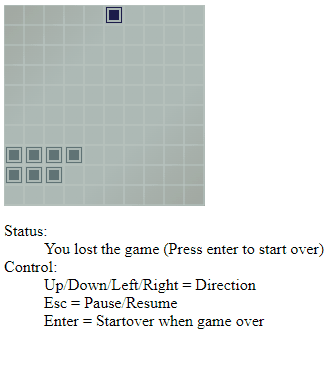

# [Vaettir-React](https://github.com/Kelerchian/vaettir/tree/master/vaettir-react)

A turing-complete agent that manage your state.

```
npm install vaettir-react
```

## Driving Philosophy

The existing passive state management libraries needs a input (e.g. dispatch, method call) to work.
Being a sub-turing-complete language constructs (e.g. state machine, actor model) makes it hard to model turing-complete processes like managing concurrent asynchronous calls from many React components.
It doesn't scale to certain complexity, making it hard to maintain above certain threshold.

An agent is a turing-complete and concurrent construct--a self executing object.
It can both react to inputs and act without.
Managing concurrent control flow from external parties is simpler.
Think of a mini server running inside your application.

Vaettir-React provides API that allows developers to design agents that:

- can be linked to React's component lifetime
- can flexibly signal changes to trigger React's component re-render

This results in a loose-coupling with React component without extra hassle, making both the agent and the components easy to refactor.

### Accompanying Library

Vaettir depends on and works well with [systemic-ts-utils](https://github.com/Kelerchian/systemic-ts-utils).

## Demo

[A snake game on canvas and UI modelled with agents.](/examples/6-snake-demo/)

Check out how the snake game is modelled in agent and structured in a convenient way.



## Basics

Imagine an imaginary scenario: a react component that updates periodically.
It is easily written in Vaettir as an agent containing an async loop.

```tsx
import { VaettirReact } from "vaettir-react";

type AutomaticDataUpdater = ReturnType<typeof AutomaticDataUpdater>;
const AutomaticDataUpdater = (url: string) =>
  Vaettir.build()
    .api(({ channels, isDestroyed }) => {
      const data = {
        posts: [] as Post[],
      };

      (async () => {
        // Update post every 10 seconds
        // Until this agent is destroyed
        while (!isDestroyed()) {
          await updatePosts();
          await sleep(10000);
        }
      })();

      const updatePosts = () => {
        const latestPosts = fetchPosts(url);
        if (deepEqual(data.posts, latestPosts)) return;
        data.posts = latestPosts;
        // signal change to external subscriber
        channels.change.emit();
      };

      return {
        getPosts: () => [...data.posts],
      };
    })
    .finish();
```

The agent has an internal async loop which updates every 10 seconds until the agent is destroyed.
It also exposes a function to view its internal `data.posts` simply via the `return` keyword.
This is simply just a typed [closure](https://developer.mozilla.org/en-US/docs/Web/JavaScript/Closures).

From the React Component's side, we can control how long an agent lives.
A React component can "own" an agent; when the component is mounted and unmounted, it will respectively create and destroy the agent.
An owning component automatically re-render when detecting changes from the agent, signaled by the call to `channels.change.emit()`.

```tsx
import * as React from "react";

const SomeComponent = ({ url }: { url: string }) => {
  const agent = VaettirReact.useOwned(() => AutomaticDataUpdater(url), [url]); // [url] is a dependency array similar to useEffect's dependency array, except that it defaults to []

  return <SomeOtherComponentThatRendersPost posts={agent.getPosts()} />;
};
```

React components can receive an agent from its props--an unowned agent.
Calling `VaettirReact.use(agent)` will make the React component re-render when the agent signals a change.

```tsx
import * as React from "react";

const PostCount = ({ agent }: { agent: AutomaticDataUpdater }) => {
  // The component listens to the agent's changes and re-renders with it
  VaettirReact.use(agent);
  return <div>Number of posts = {agent.getPosts().length}</div>;
};
```

Sharing agents between React components effectively shares its exposed APIs.
This allows components to communicate between each other through the agent.

## Context

Vaettir-React comes with toolings to distribute agents via React context.
The context works exactly like React context with a similar but more precise API.

```tsx
// defined in a separate module
export const AutomaticDataUpdater = (url: string) =>
  Vaettir.build()
    .api(() => {
      // internal implementation
      return {};
    })
    .finish();
export const AutomaticDataUpdaterContext =
  VaettirReact.Context.make<AutomaticDataUpdater>();
```

Agents are injected into the context by passing it through `<Context.Provide value={agent}>`;

```tsx
import { AutomaticDataUpdaterContext } from "some/path";

export const RootComponent = () => {
  const agent = VaettirReact.useOwned(() =>
    AutomaticDataUpdater(SOME_URL),
  );

  return (
    <AutomaticDataUpdateContext.Provide value={agent}>
      <App>
    </AutomaticDataUpdateContext.Provide>
  );
};
```

Under the provided context, any components can use the agent by calling `Context.use()`.

```tsx
import { AutomaticDataUpdaterContext } from "some/path";

export const SubComponent = () => {
  // uses an agent and listen to its changes
  const agent = AutomaticDataUpdaterContext.borrowListen();
  // AutomaticDataUpdaterContext.borrow() can be used to avoid listening to changes

  return (
    <button
      onClick={() => {
        agent.doStuffs();
      }}
    >
      Some action
    </button>
  );
};
```
